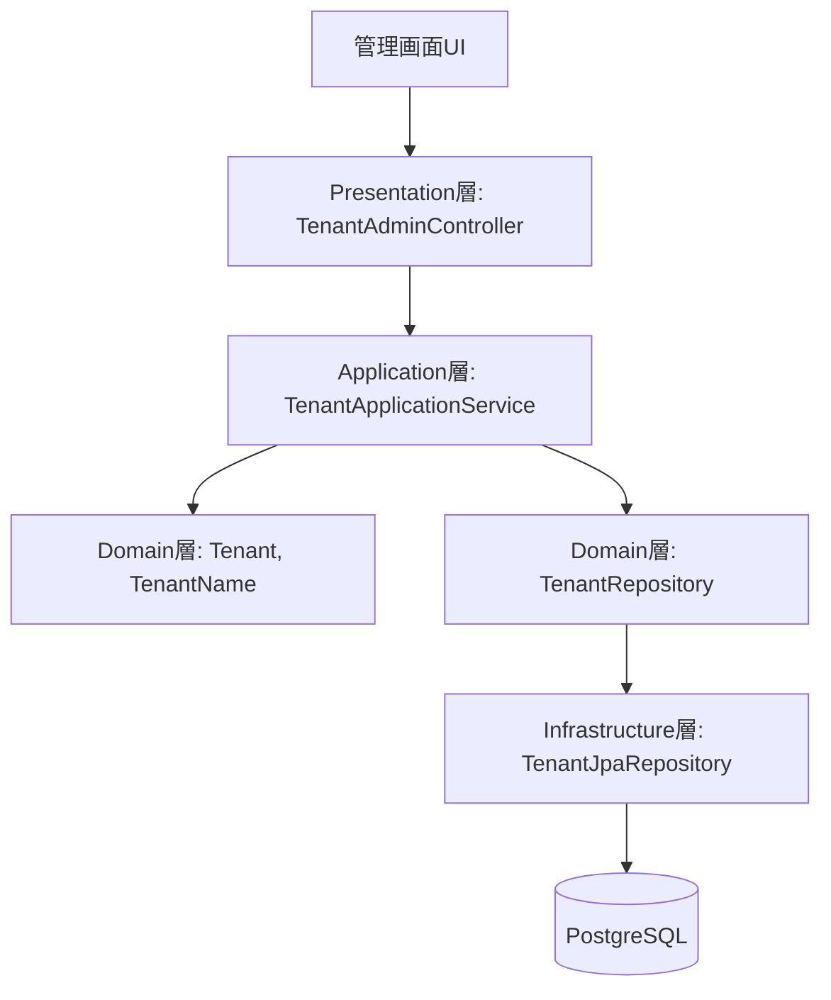
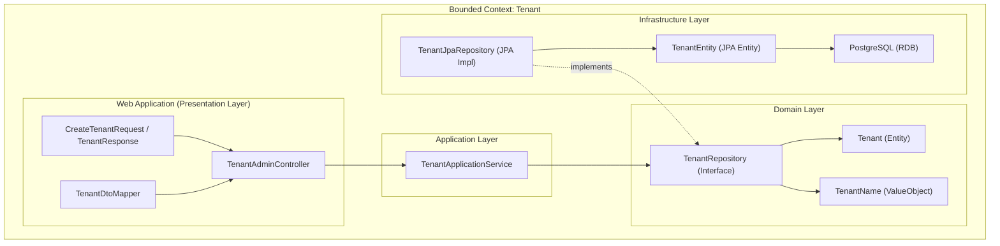

# Tenant API 設計

本ドキュメントは、ChatGPTで行った Tenant API設計 に関するドキュメントです。  
設計方針（ADR要点）、DDDレイヤ構成、各クラスの役割表、ファイルツリーを記載します。

---

## ✅ 設計方針（ADR要約）

### 決定事項

- プレゼンテーション層はREST APIの責任に限定し、DTOでアプリケーション層とやり取りする
- アプリケーション層はユースケース制御に専念し、ドメイン層の調停役を担う
- 永続化の技術依存はInfrastructure層に閉じ込め、ドメイン層からはRepositoryインターフェースのみ参照
- Value Object（例：TenantName）は初期化時に不変条件をチェックする

### 理由

- 将来的なユースケース追加（テナント更新・削除）への拡張性を担保するため
- 単体テストの独立性を保ち、インフラに依存しないドメインロジック検証を可能にするため

---

## 🧱 DDDレイヤ構成（C4 Containerレベル）

| レイヤ        | 主な責務と構成要素                                       | 例（Tenant APIの場合）                     |
|------------|-------------------------------------------------|--------------------------------------------|
| Presentation 層 | Controller・DTOを通じて外部クライアントと接続（REST APIリクエストの入口） | `TenantAdminController`, `TenantResponse` |
| Application 層 | ユースケースの制御、ドメインと外部との橋渡しを担う。ServiceやUseCaseクラスなど  | `TenantApplicationService`                |
| Domain 層    | 業務ロジックの中心。Entity, ValueObject, DomainService など | `Tenant`, `TenantName`, `TenantRepository`|
| Infrastructure 層 | 技術的実装。DBアクセス、外部API連携、リポジトリ実装、JPAエンティティ等         | `TenantJpaRepository`, `TenantEntity`     |

## 🧩 レイヤ構成図（APIフロー）



📋 各レイヤの役割一覧（責務については、各ファイルに kdocs 形式で記載）

| 層              | パッケージ                                      | クラス / コンポーネント名                                   | 役割概要                                       |
| -------------- | ------------------------------------------ | ------------------------------------------------ |--------------------------------------------|
| Presentation   | `presentation.admin.tenant`                | TenantAdminController                            | REST APIの入口。DTOの受け取り、バリデーション、サービス呼び出し、例外処理 |
| Presentation   | `presentation.admin.tenant.dto`            | CreateTenantRequest / TenantResponse             | 入出力DTO、バリデーションやドメイン変換を担当                   |
| Application    | `application.tenant.service`               | TenantApplicationService                         | ユースケースを実行。ドメインとインフラ層を調停                    |
| Domain         | `domain.tenant.entity`                     | Tenant                                           | テナントのドメインエンティティ。IDと名前を保持                   |
| Domain         | `domain.tenant.valueobject`                | TenantName                                       | init で生成時に不変条件を検証し、不正値を排除する                |
| Domain         | `domain.tenant.repository`                 | TenantRepository                                 | 永続化に非依存なリポジトリインターフェース                      |
| Infrastructure | `infrastructure.persistence.tenant`        | TenantJpaRepository / TenantSpringDataRepository | Spring Data JPA実装。ドメインリポジトリを実装             |
| Infrastructure | `infrastructure.persistence.tenant.entity` | TenantJpaEntity                                  | JPAエンティティ。DBスキーマとのマッピング                    |
| Infrastructure | `infrastructure.persistence.tenant.mapper` | TenantMapper                                     | ドメイン ⇄ JPA の変換（MapStruct）                  |
| Infrastructure | `infrastructure.persistence.converter`     | TenantNameConverter                              | VO ⇄ DB型の変換（JPA Converter）                 |
| Infrastructure | `infrastructure.persistence.common`        | AuditableJpa                                     | 共通の監査情報（作成日時、更新日時など）                       |

> 💡補足：`TenantMapper` や `TenantNameConverter` は、ドメイン層とインフラ層の境界で役割を持つ変換コンポーネントです。  
> これらを通じて、**JPAやDB依存の型がドメインに侵食することを防ぎ**、純粋なドメインロジックの保護を実現しています。

## 🧩 クラス間の関係図



## 📁 ファイルツリー（Tenant API）

```plaintext
src/main/kotlin/com/example/kteventsaas/
├── application/
│   └── tenant/
│       └── service/
│           └── TenantApplicationService.kt
├── domain/
│   └── tenant/
│       ├── entity/
│       │   └── Tenant.kt
│       ├── repository/
│       │   └── TenantRepository.kt
│       └── valueobject/
│           └── TenantName.kt
├── infrastructure/
│   └── persistence/
│       ├── tenant/
│       │   ├── TenantJpaRepository.kt
│       │   ├── TenantSpringDataRepository.kt
│       │   ├── entity/
│       │   │   └── TenantJpaEntity.kt
│       │   ├── mapper/
│       │   │   └── TenantMapper.kt
│       └── converter/
│       │   └── TenantNameConverter.kt
│       └── common/
│           └── AuditableJpa.kt
└── presentation/
    └── admin/
        └── tenant/
            ├── TenantAdminController.kt
            └── dto/
                ├── CreateTenantRequest.kt
                └── TenantResponse.kt
```
