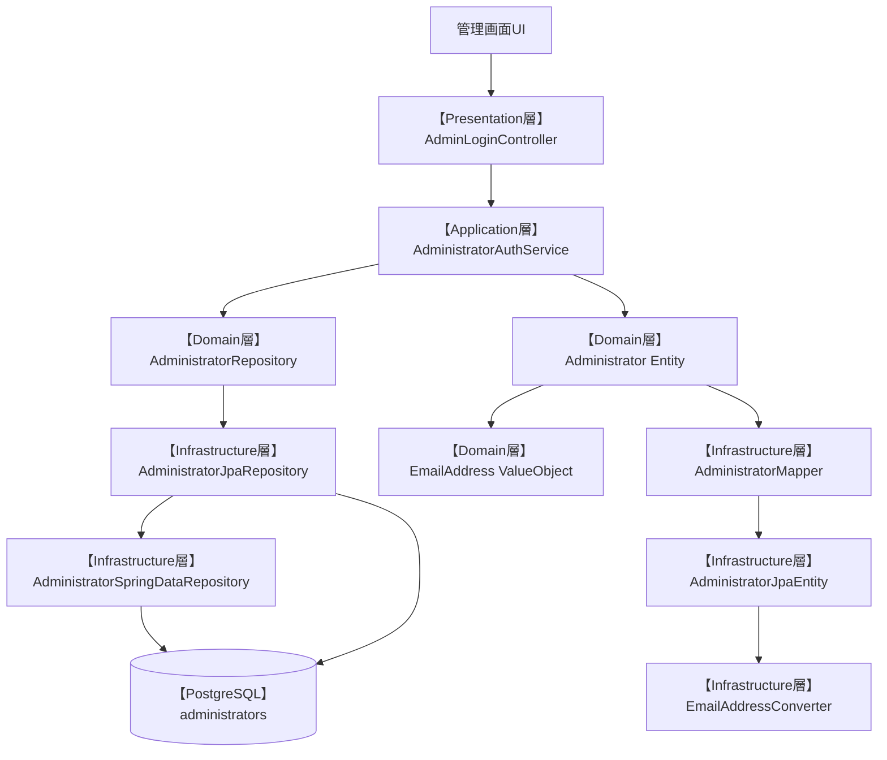
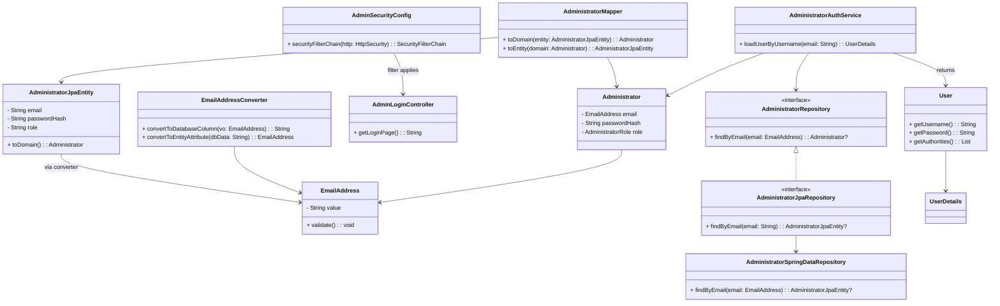

# Administrator 認証機構 設計

本ドキュメントは、ChatGPTで行った Administrator 認証機構 のドキュメントです。  
設計方針（ADR要点）、DDDレイヤ構成、各クラスの役割表、ファイルツリーを記載します。  

---

## ✅ 設計方針（ADR要約）

### 決定事項

* ドメイン層、アプリケーション層、プレゼンテーション層、インフラ層を明確に分離し、責務に応じて各レイヤにクラスを配置している（DDD準拠）
* メールアドレスはプリミティブな `String` ではなく、`EmailAddress` Value Object として定義する
* 不変条件（空文字・メール形式）を生成時に強制し、常にバリデーション済みの値のみを保持させる
* 永続化における `String` との変換は、JPAの `@Converter` 実装に委ねる
* 他の認証ドメイン（Organizer / Customer）でも再利用可能な構成とする

### 理由

* 将来的な機能拡張（ロール追加、ログイン制御の柔軟化）にも対応可能な構成を意識したため
* ロジックを分散させず、メール形式の検証責務を明示的にドメインで担保するため
* セキュリティ上も意図しない文字列の混入（空文字、SQLメタ文字等）を防ぎたい
* ドメイン層をJPAやDBの型制約から分離し、型安全な設計を実現するため

---

## 🧱 DDDレイヤ構成

| レイヤ             | 主な責務と構成要素                             | 例（Administrator認証）                               |
| --------------- | ------------------------------------- | ------------------------------------------------ |
| Presentation層   | ログインフォーム表示 / DTO受信                    | `AdminLoginController`, `LoginRequest`           |
| Application層    | 管理者認証ユースケース、UserDetailsService化       | `AdministratorAuthService`                       |
| Domain層         | メールアドレスVO、管理者Entity、ロール定義             | `EmailAddress`, `Administrator` |
| Infrastructure層 | VO変換（Converter）、JPA永続化、FilterChainの定義 | `EmailAddressConverter`, `AdminSecurityConfig`   |

## 🖼 テンプレート構成（View）

Thymeleafテンプレートは以下に配置され、Controllerからレンダリングされます。

```plaintext
src/main/resources/templates/admin/
├── login.html        // 管理者ログイン画面
└── dashboard.html    // ログイン後のダッシュボード画面
```

---

## 🔐 管理者セッション認証の責務マッピング

| レイヤ                | 主な責務                           | クラス                                                        |
|--------------------| ------------------------------ | ---------------------------------------------------------- |
| Presentation層      | ログインフォーム表示/ 送信処理               | `AdminLoginController.kt`, `login.html`                    |
| Application層       | ユーザー取得＆UserDetails化            | `AdministratorAuthService.kt`（`UserDetailsService`）        |
| Domain層            | 管理者の定義 (Entity + Role + Email) | `Administrator.kt`, `EmailAddress.kt` |
| Infrastructure層    | JPA永続化、FilterChain設定           | `AdminSecurityConfig.kt`, `JpaRepository`, `Mapper`        |
| Template（Viewリソース） | ログイン・ダッシュボード画面表示               | `login.html`, `dashboard.html`                             |

---

## 🧩 レイヤ構成図


※ Spring Security の標準フォーム認証を使用しており、/admin/login/auth への POST リクエストは、
UsernamePasswordAuthenticationFilter が自動で処理する。  
そのため【Presentation層】LoginRequest DTO を定義する必要はない。

---

## 📋 各レイヤの役割一覧

| 層              | パッケージ                                     | クラス / コンポーネント名                      | 役割概要                                   |
| -------------- | ----------------------------------------- |-------------------------------------|----------------------------------------|
| Presentation   | `presentation.admin.auth`                 | `AdminLoginController`              | ログインフォーム表示 / 認証リクエスト処理                 |
| Presentation   | `presentation.admin.auth.dto`             | ~~`LoginRequest`~~                    | ログインフォームDTO（今回は不要）     |
| Application    | `application.admin.service`               | `AdministratorAuthService`          | UserDetailsService 実装。Spring Security連携 |
| Domain         | `domain.admin.entity`                     | `Administrator`                     | 管理者 Entity。メールアドレス、パスワードハッシュ、ロールを保持    |
| Domain         | `domain.admin.valueobject`                | `EmailAddress`, `AdministratorRole` | Email形式のValueObject、ロール定義              |
| Domain         | `domain.admin.repository`                 | `AdministratorRepository`           | 永続化に非依存なドメインリポジトリ                      |
| Infrastructure | `infrastructure.persistence.converter`    | `EmailAddressConverter`             | EmailAddress <-> String の変換            |
| Infrastructure | `infrastructure.persistence.admin`        | `AdministratorJpaRepository`        | Repository 実装（Spring Data JPA）         |
| Infrastructure | `infrastructure.persistence.admin`        | `AdministratorSpringDataRepository` | Spring によりDBクエリメソッドが自動生成されるインターフェース    |
| Infrastructure | `infrastructure.persistence.admin.entity` | `AdministratorJpaEntity`            | DBスキーマとマッピングされる JPA Entity             |
| Infrastructure | `infrastructure.persistence.admin.mapper` | `AdministratorMapper`               | Domain ↔ JPA の変換（MapStruct）            |
| Infrastructure | `infrastructure.security`                 | `AdminSecurityConfig`               | `/admin/**` 専用の SecurityFilterChain 定義 |

### 🔄 LoginRequest DTO 非導入の方針

`LoginRequest` DTO は当初、フォームログインの `email` / `password` を明示的に受け取るために検討された。  
しかし、現在の構成では Spring Security の `UsernamePasswordAuthenticationFilter` により  
POST `/admin/login/auth` は自動的に処理されており、DTOをアプリケーション側で受け取ることがないため実装しなかった。

### 🔄 LoginResponse DTO 非導入の方針
本ログイン処理は、  
Thymeleaf によるサーバーサイドレンダリング UI を用いた、セッションベースのフォーム認証である。  
この方式は、JSON形式のリクエスト・レスポンスを伴う REST API とは異なり、  
画面遷移は認証後にテンプレートへのリダイレクトによって完結する。  

よって、認証結果をクライアントに構造化された DTO（例：LoginResponse）として返却する必要はない。  

### ✅ LoginResponse DTO を導入しない理由
| 観点           | 内容                                                                          |
| ------------ | --------------------------------------------------------------------------- |
| UI遷移         | 認証後は `RedirectView` によりページ遷移が完了し、レスポンスにログイン結果情報を含める必要がない。                   |
| セッション管理      | Spring Security によりセッションIDが自動的にCookieに付与されるため、トークン等を明示的に返却するAPIは存在しない。      |
| REST APIではない | 本認証機構はSPAや外部クライアント向けのREST APIではなく、Thymeleafベースの管理画面に限定されるため、DTOレスポンスは不要である。 |

---

## ✅ 各レイヤ別ファイルの必要性と理由

| 層              | クラス / コンポーネント名                      | 必要性        | 理由・背景                                                                                                  |
| -------------- |-------------------------------------|------------|--------------------------------------------------------------------------------------------------------|
| Presentation   | `AdminLoginController`              | ⭐️最小構成で必須  | フォーム認証を行うには、ログイン画面の表示（GET）と送信（POST）を処理するコントローラが必要。`/login` のようなUIエントリーポイントを提供する。                       |
| Presentation   | `LoginRequest`                      | 🛑使用しない方針  | 標準フォーム認証に従っており、DTOとして `LoginRequest` を Controller で受け取る構成でないため不要。Spring Securityがフォーム認証を自動処理しない構成では必要。 |
| Presentation   | `LoginResponse`                     | 🛑使用しない方針 | 認証結果はページ遷移（リダイレクト）によって表現され、クライアントに構造化されたDTOとして返却する必要がないため、`LoginResponse` は導入していない。                    |
| Application    | `AdministratorAuthService`          | ⭐️最小構成で必須  | `UserDetailsService` を実装し、Spring Security の認証処理と連携。ユーザー検索と認証ロジックの中心を担う。                                |
| Domain         | `Administrator`                     | ⭐️最小構成で必須  | ログイン対象の「ユーザー」実体。このアプリにおいては認証対象そのものなので絶対必要。                                                             |
| Domain         | `EmailAddress`                      | 🧩DDD方針で必要 | 単なる `String` ではなくドメイン制約（形式チェック・空文字禁止など）を強制するための Value Object。型安全かつ意図が明確な実装方針を採用するなら不可欠。                |
| Domain         | `AdministratorRepository`           | 🧩DDD方針で必要 | ドメイン層がインフラ層に依存しないために、`JpaRepository` に対する抽象インターフェースをドメイン側に定義。DDDの「依存逆転」の原則を実現。                         |
| Infrastructure | `EmailAddressConverter`             | 🧩DDD方針で必要 | JPAで `EmailAddress` を `String` に変換するための `@Converter`。プリミティブ以外のVOを永続化対象にするには必須。                         |
| Infrastructure | `AdministratorJpaRepository`        | ⭐️最小構成で必須  | ドメインリポジトリの実装クラス。Spring Data の自動実装リポジトリに委譲し、Entity変換を仲介するアダプター。                                         |
| Infrastructure | `AdministratorSpringDataRepository` | ⭐️最小構成で必須  | Spring により DBクエリメソッドが自動生成されるインターフェース。実際の JPA エンティティに対する永続化処理の起点となる。                                    |
| Infrastructure | `AdministratorJpaEntity`            | ⭐️最小構成で必須  | DBの `administrators` テーブルにマッピングされるJPA Entity。`@Entity` アノテーション付きクラスとして必要。                              |
| Infrastructure | `AdministratorMapper`               | 🧩DDD方針で必要 | `JpaEntity` ↔ `Domain` 間の変換を担う。JPA Entity をそのままドメインに使わず分離する方針においては必要（MapStructで省力化可能）。                 |
| Infrastructure | `AdminSecurityConfig`               | ⭐️最小構成で必須  | `/admin/**` に対する `SecurityFilterChain` の定義。Spring Securityをルート単位で分離する設計なら各ドメインに必要。                     |
※ [Domain層] に AdministratorRole をロールごとの画面制御や機能制限を実装するなら初期段階から用意しておくのが望ましいが、今回は割愛

---

🗂 分類まとめ（必要性レベル）

| 分類                                   | 必須ファイル                                                                                                                                                        |
| ------------------------------------ | ------------------------------------------------------------------------------------------------------------------------------------------------------------- |
| ⭐️ **最小構成で必要**                       | `AdminLoginController`, `LoginRequest`, `AdministratorAuthService`, `Administrator`, `AdministratorJpaRepository`, `AdministratorJpaEntity`, `AdminSecurityConfig` |
| 🧩 **DDD・型安全志向ゆえに必要**                | `EmailAddress`, `AdministratorRepository`, `EmailAddressConverter`, `AdministratorMapper`                                                    |
| 🛑 **使用しない方針（将来的にも不要）**          | `LoginRequest`, `LoginResponse`（Spring Security による標準フォーム認証とサーバーサイドレンダリング構成のため、DTOによるリクエスト／レスポンス構造は不要） |
| 🕒 **将来のために先行作成ではない**（＝現時点で不要なものはない） | ※すべて役割が定義されており、意図的に除外されたDTO類を除けば不要なファイルはない構成です。                            |

---

## 🧩 クラス間の関係



## 📁 ファイルツリー (v1.0.0)

```plaintext
src/main/kotlin/com/example/kteventsaas/
├── application/
│   └── admin/
│       └── service/
│           └── AdministratorAuthService.kt
├── domain/
│   └── admin/
│       ├── entity/
│       │   └── Administrator.kt
│       ├── repository/
│       │   └── AdministratorRepository.kt
│       └── valueobject/
│           └── EmailAddress.kt
├── infrastructure/
│   └── persistence/
│       ├── admin/
│       │   ├── AdministratorJpaRepository.kt
│       │   ├── AdministratorSpringDataRepository.kt
│       │   ├── entity/
│       │   │   └── AdministratorJpaEntity.kt
│       │   ├── mapper/
│       │   │   └── AdministratorMapper.kt
│       └── converter/
│       │   └── EmailAddressConverter.kt
│       └── security/
│           └── AdminSecurityConfig.kt
├── presentation/
│   └── admin/
│       └── auth/
│           └── AdminLoginController.kt
└── resources/
    └── templates/
        └── admin/
            ├── login.html
            └── dashboard.html
```
