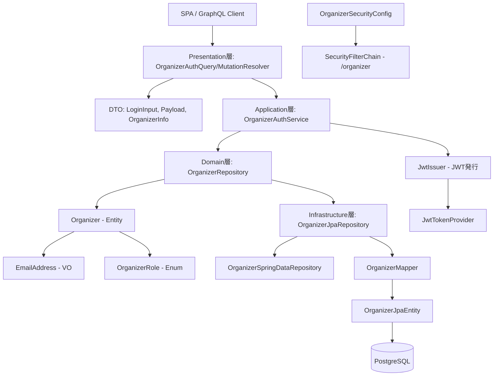
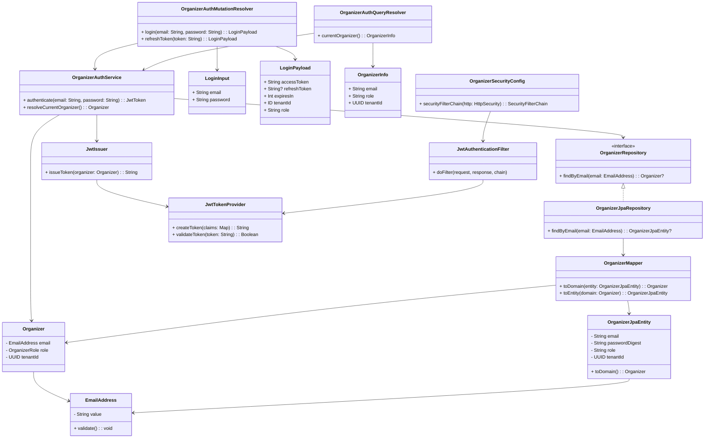

# Organizer 認証機構 設計

本ドキュメントは、ChatGPTで行った Organizer 認証機構 のドキュメントです。  
設計方針（ADR要点）、DDDレイヤ構成、各クラスの役割表、ファイルツリーを記載します。

---

## ✅ 設計方針（ADR要約）

### 決定事項

* Organizer はテナント単位で管理されるユーザーとして認識される
* 認証方式に JWT を採用し、ステートレスAPIとして認証を実現
* Organizer は OWNER ロールとして Tenant 登録時に必ず1名定義される
* JWTの証明情報に `tenantId`, `role`, `sub` (メール) を含める
* REST でなく GraphQL スキーマファーストを採用し、スキーマと1:1対応させる

### 理由

* SaaS構成下でのマルチテナント認証に対応するため
* JWTを用いることで、SPAやGraphQLとの連携を容易にする
* 初期登録ユーザー(OWNER)をTenant作成時に一括登録することで、別途での管理を要さずシンプルな設計を実現

#### 📘 補足: JWT認証とは？

- JWT 認証では「クライアントが持つアクセストークン（多くは JWT）」を使ってステートレスに認可を行い、  
  アクセストークン期限切れ対策として「リフレッシュトークンで新しいアクセストークンを取得する」という形で両者が連携する。  

- これにより、セッション情報をサーバー側に保持せずに安全な認証・再認証が可能。

---

### 📐 DTO クラスについて

認証機構で利用する DTO クラス名は、GraphQL スキーマ（SDL）と完全に一致させるために、以下の命名規則を採用します:

| クラス名           | 用途                                          |
| -------------- | ------------------------------------------- |
| `LoginInput`   | ログイン要求（email, password）                     |
| `LoginPayload` | レスポンス（accessToken, refreshToken, expiresIn） |

### 採用理由

1. **型安全・仕様ドリブン**
    * GraphQL SDL を唯一の真実源とし、クラス名をスキーマに揃えることで開発ミスを防止

2. **Codegen ツール親和性**
    * スキーマ変更 → 自動生成クラスの命名変更フローを CI に組み込みやすく、生産性と保守性を向上

3. **開発効率向上**
    * 手動マッピングコードを削減し、Resolver 実装をシンプルに保てる

---

## 🧱 DDDレイヤ構成

| レイヤ              | 主な責務と構成要素                                        | 例 (オーガナイザー認証)                                                                        |
| ---------------- |--------------------------------------------------|--------------------------------------------------------------------------------------|
| Presentation 層   | GraphQL APIのログイン処理、DTOとの繋ぎ込み                     | `OrganizerAuthQuery/MutationResolver`, `LoginInput`, `LoginPayload`, `OrganizerInfo` |
| Application 層    | 認証ユースケースの制御、JWT発行処理                              | `OrganizerAuthService`, `JwtIssuer`                                                  |
| Domain 層         | Organizerエンティティ、ValueObject、Repository interface | `Organizer`, `EmailAddress`, `OrganizerRole`, `OrganizerRepository`                  |
| Infrastructure 層 | JPA実装、JWT発行ユーティリティ、Security設定                    | `OrganizerJpaEntity`, `JwtTokenProvider`, `OrganizerSecurityConfig`                  |

## 🖼 テンプレート構成(View)

対象外（JWT認証 + SPA/GraphQLを前提とするためThymeleafなし）

## 📜 スキーマ構成 (SDL)

```graphql
input LoginInput {
  email: String!
  password: String!
}

type LoginPayload {
  accessToken: String!
  refreshToken: String
  expiresIn: Int!
  tenantId: ID!
  role: String!
}

type Mutation {
  loginOrganizer(input: LoginInput!): LoginPayload!
  refreshToken(token: String!): LoginPayload!
}
```
ポイント: クラス名を GraphQL SDL と完全一致させ、graphql-kotlin や Apollo Codegen との連携がシームレスに。


## 🔐 イベント主催者JWT認証の責務マッピング

| レイヤ            | 責務概要                                 | 代表的なクラス / 機能                                                        |
| -------------- | ------------------------------------ | ------------------------------------------------------------------- |
| Presentation   | ログイン情報の受け取り、GraphQLレシーバの構成           | `OrganizerLoginResolver`, `LoginRequestDTO`                         |
| Application    | Organizerの找続、証明情報(JWT payload)の生成    | `OrganizerAuthService`, `JwtIssuer`                                 |
| Domain         | Organizer情報の保持、検索ロジックの提供             | `Organizer`, `EmailAddress`, `OrganizerRole`                        |
| Infrastructure | OrganizerデータのJPA管理、JWT発行 / 検証ロジックの実装 | `OrganizerJpaRepository`, `JwtTokenProvider`, `SecurityFilterChain` |

## 🧩 レイヤ構成図



## 📋 各レイヤの役割一覧

| レイヤ             | パッケージ例                                        | クラス / コンポーネント名                                | 役割概要                                          |
| --------------- | --------------------------------------------- | --------------------------------------------- |-----------------------------------------------|
| Presentation層   | `presentation.organizer.auth`                 | `OrganizerAuthQuery/MutationResolver`         | GraphQL の認証関連リゾルバ（ログイン、トークン再発行、認証状態確認など）      |
| Presentation層   | `presentation.organizer.auth.dto`             | `LoginInput`, `LoginPayload`                  | GraphQL での入力・出力 DTO（後続の JWT レスポンス含む）          |
| Presentation層   | `presentation.organizer.auth.dto`             | `OrganizerInfo`                               | `currentOrganizer` クエリのレスポンス型。認証済ユーザーの属性を返却   |
| Application層    | `application.organizer.service`               | `OrganizerAuthService`                        | Organizer の検索、認証判定、および UserDetails への変換を担う    |
| Application層    | `application.organizer.service.jwt`           | `JwtIssuer`, `JwtPayloadFactory`              | 認証済みユーザーに対してトークンを発行。認可クレームの整形も行う              |
| Domain層         | `domain.organizer.entity`                     | `Organizer`                                   | Organizer の業務モデル。メール・ロール・テナント ID を保持          |
| Domain層         | `domain.organizer.valueobject`                | `EmailAddress`, `OrganizerRole`               | メールやロールを型安全に保持・検証するための値オブジェクト                 |
| Domain層         | `domain.organizer.repository`                 | `OrganizerRepository`                         | Organizer 永続化の抽象定義。インフラ実装とは非依存                |
| Infrastructure層 | `infrastructure.persistence.organizer`        | `OrganizerJpaRepository`, `OrganizerMapper`   | Domain ↔ JPA 変換、および Repository の具象実装          |
| Infrastructure層 | `infrastructure.persistence.organizer.entity` | `OrganizerJpaEntity`                          | JPA エンティティ（テーブルとのマッピング）                       |
| Infrastructure層 | `infrastructure.security.jwt`                 | `JwtTokenProvider`, `JwtAuthenticationFilter` | JWT の発行・検証、HTTP リクエストに対する認可制御を実装              |
| Infrastructure層 | `infrastructure.security.config`              | `OrganizerSecurityConfig`                     | `/organizer/**` 用の SecurityFilterChain 設定     |

## ✅ 各レイヤ別ファイルの必要性と理由

| 層               | クラス / コンポーネント名                              | 必要性分類    | 理由                                                      |
| --------------- |---------------------------------------------| -------- | ------------------------------------------------------- |
| Presentation層   | `OrganizerAuthQuery/MutationResolver`       | ⭐️ 必須    | GraphQL 経由での認証関連リクエスト（ログイン、再発行、状態確認など）を受け取り、認証ユースケースに委譲する役割               |
| Presentation層   | `LoginInput`, `LoginPayload`                | ⭐️ 必須    | GraphQLでの入力（メール・パスワード）と出力（JWTトークン）を構造化してやり取りするため        |
| Presentation層   | `OrganizerInfo`                             | ⭐️ 必須    | currentOrganizer クエリのレスポンスとして、ログイン済ユーザーの情報を提供するため        |
| Application層    | `OrganizerAuthService`                      | ⭐️ 必須    | ユーザー検索・認証処理を担い、Spring Security 連携および JWT生成ロジックを制御       |
| Application層    | `JwtIssuer`, `JwtPayloadFactory`            | ⭐️ 必須    | ロール・テナント・サブジェクトなどの情報をJWTとして発行するためのユーティリティ               |
| Domain層         | `Organizer`                                 | ⭐️ 必須    | メール・ロール・テナントIDなど認証・認可に必要な属性を定義したドメインエンティティ              |
| Domain層         | `EmailAddress`, `OrganizerRole`             | 🧩 型安全志向 | 値の整合性（空文字・メール形式等）を保証するためのValueObject。ロールの定義も列挙体で管理      |
| Domain層         | `OrganizerRepository`                       | 🧩 DDD構成 | 永続化技術に依存しない設計とし、アプリケーション層からドメインに依存をとどめるため               |
| Infrastructure層 | `OrganizerJpaRepository`, `OrganizerMapper` | ⭐️ 必須    | JPA + Spring Data により永続化処理を担う具象実装と、Entity ↔ Domainの変換責務 |
| Infrastructure層 | `OrganizerJpaEntity`                        | ⭐️ 必須    | テーブルとの対応関係を明示し、UUID, Email, Role などのDBカラムにマッピング         |
| Infrastructure層 | `JwtTokenProvider`                          | ⭐️ 必須    | JWTトークンの発行・検証を担う中核コンポーネント                               |
| Infrastructure層 | `JwtAuthenticationFilter`                   | ⭐️ 必須    | HTTPリクエストにおけるAuthorizationヘッダを検査し、認可処理を行うフィルタ           |
| Infrastructure層 | `OrganizerSecurityConfig`                   | ⭐️ 必須    | `/organizer/**` のリクエストに対するSecurityFilterChainの設定        |

## 🧩 クラス間の関係



## 📘 補足: GraphQLを採用する理由

JWT認証を前提とした場合、REST APIと比べてGraphQLを採用することには次のような利点があります：

| 観点                | GraphQL（+JWT認証）                                   | REST API（+JWT認証）                  |
| ----------------- | ------------------------------------------------- | --------------------------------- |
| 🎯 **柔軟なデータ取得**   | クライアントが必要なフィールドだけを指定可能。過不足のない取得が可能。               | エンドポイントごとに固定レスポンス。不要なデータも含まれがち。   |
| 🔗 **1リクエスト複数操作** | 単一クエリで複数のエンティティを横断的に取得できる                         | リソース単位でエンドポイント分割。複数回リクエストが必要になる   |
| 📐 **型安全なスキーマ**   | JWTから抽出した `role`, `tenantId` をGraphQLスキーマで制御可能    | エンドポイント単位の処理が中心。型レベルの認可制御は自前実装が必要 |
| 🛡 **認可粒度の統一**    | Fieldレベルの権限制御が可能。`@PreAuthorize` や自作directiveで対応可 | メソッド単位でしか認可しにくく、粒度が粗くなりがち         |
| 🧾 **ドキュメント自動生成** | スキーマ＝仕様。GraphiQLやPlaygroundで直感的な探索が可能             | Swagger等を併用する必要があり、実装と乖離する場合も     |
| 🌐 **SPAとの親和性**   | クライアント状態に応じた効率的なデータ取得（Apollo等との連携）                | 複数APIをコールし、状態同期が煩雑になりやすい          |

これにより、Organizerドメインにおいては以下のようなメリットが得られます：

* 必要な情報だけを効率的に取得でき、API設計がユースケース単位で柔軟に
* テナント情報やロールによる認可をGraphQLスキーマやResolver内で統一的に適用可能
* 認可構成をコード＋スキーマで可視化しやすく、保守性が高い

---

## 📝認証フロー概要

以下の 4 段階で、オーガナイザー向け JWT 認証の一連の流れを整理しています。

### 1. ログインフェーズ

1. **クライアント** が GraphQL ミューテーション `loginOrganizer(input: LoginInput)` を実行（ペイロード: `{ email, password }`）。
2. **Resolver** (`OrganizerLoginResolver`) で `OrganizerAuthService.loginOrganizer(input)` を呼び出し。
3. **アプリケーションサービス** (`OrganizerAuthService`) がリポジトリで Organizer を検索し、パスワードを検証。
4. **JWT 発行** (`JwtIssuer`／`JwtPayloadFactory`／`JwtTokenProvider`) により、`accessToken`・`refreshToken`・`expiresIn`・`tenantId`・`role` を生成し、`LoginPayload` として返却。

### 2. クライアント保管フェーズ

* クライアントは受け取ったトークンをローカルストレージなどに保存。
* 次回以降のリクエストでは `Authorization: Bearer <accessToken>` ヘッダを付与。

### 3. リクエスト認証フェーズ

1. `/organizer/**` 配下へのリクエスト受信。
2. **フィルタ** (`JwtAuthenticationFilter`) が Authorization ヘッダからトークンを取得し、`JwtTokenProvider.validateToken(token)` で検証、有効ならクレームを解析。
3. クレーム情報 (`sub`, `role`, `tenantId` 等) を元に `Authentication` オブジェクトを生成し、`SecurityContextHolder` にセット。
4. **SecurityConfig** (`OrganizerSecurityConfig`) により `hasRole("ORGANIZER")` でアクセス制御。

### 4. 業務処理フェーズ

* 認証済みコンテキストから現在の Organizer 情報を取得し、テナント単位・ロール単位の認可処理を実施。
* 必要に応じて `refreshOrganizerToken(token: String)` ミューテーションでリフレッシュトークンを利用した再発行を行う。

---

## 📘 補足: アクセストークンとリフレッシュトークンの違い

アクセストークンとリフレッシュトークンは、JWTベースの認証で用いられる二種類のトークンです。

### 1. アクセストークン（Access Token）

#### 用途
- リソースサーバーへのアクセス認可
   クライアントが API（GraphQL や REST）へリクエストを送る際、ヘッダに載せて送信し、  
   そのトークンだけで「誰が」「どの権限で」アクセスをしているかを示す。

#### 特性
- 有効期限が短い  
  セキュリティ強度を保つため、30 分〜数時間など比較的短時間に設定する。  
  有効期限ギリギリのトークンは扱いを慎重にし、不正利用を防止する。


- 頻繁に送受信される  
  API 呼び出し時に毎回ヘッダに含まれるため、サイズは小さく（必要最小限のクレームのみ）するのが望ましい。


- 署名検証のみ  
  リクエスト受信ごとに検証コストがかかるため、ペイロードにはあまり重いロジック（権限リストの長大な列挙など）は含めない。  
  必要最小限の情報（ユーザーID、ロール、テナントIDなど）に留める。


### 2. リフレッシュトークン（Refresh Token）

#### 用途
- アクセストークンの再発行を安全に行う  
  トークンが期限切れになった際に、再度ログイン操作をせずに新しいアクセストークンを取得するために使用。

#### 特性
- 有効期限が長い  
  数日〜数週間、場合によっては数か月と長めに設定。頻繁に更新せず、期限切れの間だけ再認証が必要になる。


- 送信機会は限定的  
  アクセストークンが期限切れになったときのみバックエンドに送る。  
  通常の API 呼び出しでは送信せず、なるべくクライアント側の保管領域（セキュアなストレージ）に留める。


- 追加の保護が必要  
  長期間有効なため、盗まれた場合のリスクが高い。  
  発行時に DB に保存しておき、使用後は一度だけ使える「ワンタイム」方式にする。  
  クライアントサイドでも Secure／HttpOnly Cookie に載せるなど、XSS／CSRF 対策を徹底する。  

| 特性       | アクセストークン         | リフレッシュトークン               |
| -------- | ---------------- | ------------------------ |
| 主な用途     | API リクエスト認可      | アクセストークン再発行              |
| 有効期限     | 短い（数分～数時間）       | 長い（数日～数週間）               |
| 送信タイミング  | 毎リクエスト時          | アクセストークン期限切れ時のみ          |
| 保管場所     | メモリ or ローカルストレージ | セキュアストレージ or セキュア Cookie |
| セキュリティ対策 | 軽量化・署名検証の最適化     | DB 管理、限定送信、Cookie 設定     |

※ 補足：初期開発やPoC段階で実装工数を抑えるため *JwtIssuer#issueRefreshToken* ではアクセストークン生成ロジックを流用しています。  
  実運用ではリフレッシュトークン専用のクレームや有効期限、署名キーを分けるなど、専用ロジックに切り替えることが推奨されます。  

---

## 📁 ファイルツリー

```plaintext
src/main/kotlin/com/example/kteventsaas/
├── presentation/
│   └── organizer/
│       └── auth/
│           ├── OrganizerAuthQueryesolver.kt
│           ├── OrganizerAuthMutationResolver.kt
│           └── dto/
│               ├── LoginInput.kt
│               ├── LoginPayload.kt
│               └── OrganizerInfo.kt
├── application/
│   └── organizer/
│       └── service/
│           ├── OrganizerAuthService.kt
│           └── jwt/
│               ├── JwtIssuer.kt
│               └── JwtPayloadFactory.kt
├── domain/
│   └── organizer/
│       ├── entity/
│       │   └── Organizer.kt
│       ├── valueobject/
│       │   ├── EmailAddress.kt
│       │   └── OrganizerRole.kt
│       └── repository/
│           └── OrganizerRepository.kt
├── infrastructure/
│   ├── persistence/
│   │   └── organizer/
│   │       ├── OrganizerJpaRepository.kt
│   │       ├── OrganizerSpringDataRepository.kt
│   │       ├── entity/
│   │       │   └── OrganizerJpaEntity.kt
│   │       └── mapper/
│   │           └── OrganizerMapper.kt
│   └── security/
│       ├── config/
│       │   └── OrganizerSecurityConfig.kt
│       └── jwt/
│           ├── JwtTokenProvider.kt
│           └── JwtAuthenticationFilter.kt
└── resources/
    └── graphql/
        └── organizer/
            └── schema.graphqls
```

---

## ✅ v2.0.0 完了チェックリスト（Organizer 認証機構）

| 区分   | チェック項目                                                             | 対象ドメイン    | 備考                                      | 対応状況 |
| ---- | ------------------------------------------------------------------ | --------- | --------------------------------------- | ---- |
| 実装   | `/organizer/graphql` に対する `SecurityFilterChain` の構築                | Organizer | JWT 認証フィルターと URL パス単位の設定                | 🔄   |
| 実装   | `OrganizerAuthMutationResolver.loginOrganizer` の実装                 | Organizer | Email + Password で JWT 発行               | 🔄   |
| 実装   | `OrganizerAuthMutationResolver.refreshOrganizerToken` の実装          | Organizer | 有効なリフレッシュトークンから再発行                      | 🔄   |
| 実装   | `JwtIssuer`, `JwtPayloadFactory`, `JwtTokenProvider` の構成           | Organizer | トークンの発行・有効期限・ペイロード組み立て                  | 🔄   |
| 実装   | `JwtAuthenticationFilter` による Authorization ヘッダの検証                 | Organizer | アクセストークン付きリクエストの認証                      | 🔄   |
| 実装   | `OrganizerAuthService.resolveCurrentOrganizer()` の追加               | Organizer | ログイン中の Organizer を SecurityContext から復元 | 🔄   |
| 実装   | **`OrganizerAuthQueryResolver.currentOrganizer` クエリの追加（JWT 保護付き）** | Organizer | トークンがない／不正な場合はアクセス拒否                    | 🔄   |
| スキーマ | GraphQL スキーマに `currentOrganizer: OrganizerInfo!` を定義               | Organizer | SDL に明示的に定義し、型の一貫性を確保                   | 🔄   |
| DTO  | `LoginInput`, `LoginPayload`, `OrganizerInfo` の定義                  | Organizer | GraphQL スキーマと 1:1 で対応させる DTO            | 🔄   |
| テスト  | `loginOrganizer` 実行でアクセストークンが返ること                                  | Organizer | 正常系ログインの自動テスト                           | 🔄   |
| テスト  | 有効なアクセストークン付きで `currentOrganizer` が成功すること                          | Organizer | 認証情報を元にログイン中ユーザーを取得                     | 🔄   |
| テスト  | トークンなし／期限切れ／不正トークンで `currentOrganizer` にアクセスできないこと                 | Organizer | `401 Unauthorized` になることを確認             | 🔄   |
