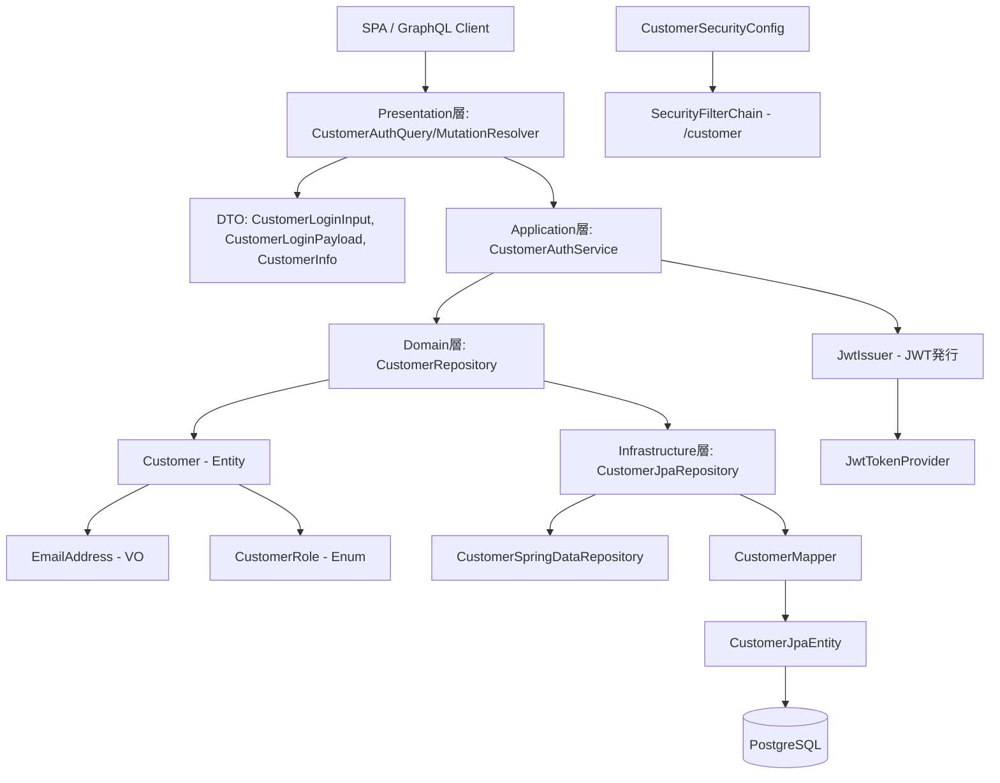
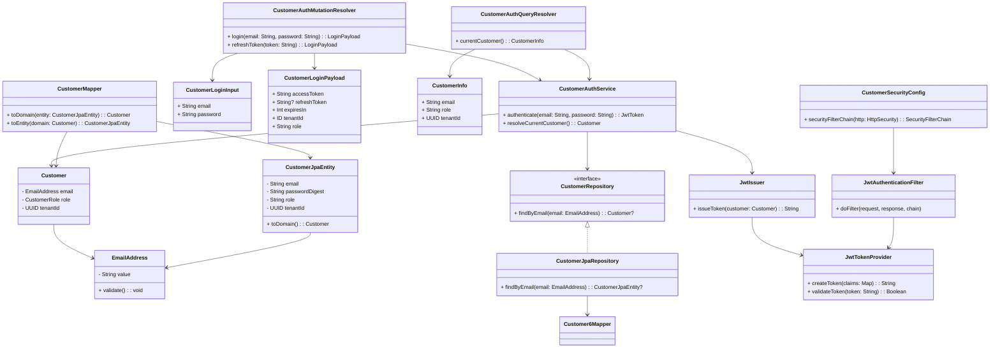

# Customer 認証機構 設計

本ドキュメントは、ChatGPTで行った Customer 認証機構 のドキュメントです。  
設計方針（ADR要点）、DDDレイヤ構成、各クラスの役割表、ファイルツリーを記載します。  

---

## ✅ 設計方針（ADR要約）

### 決定事項

* Customer はイベントに参加するエンドユーザーとして認識される
* 認証方式に JWT を採用し、ステートレスなSPAアクセスに対応
* REST API ではなく GraphQL スキーマファースト方式を採用
* JWT には `sub`, `role`, `tenantId` を含む
* Organizer と Customer で FilterChain を分離し責務を明確化

### 理由

* Organizer 同様、マルチテナントかつGraphQL対応SPAを前提とした設計
* JWTにより、参加者画面からのセッションレスなアクセスを実現

---

## 🧱 DDDレイヤ構成

| レイヤ             | クラス例                                                                                                                                    |
| --------------- | --------------------------------------------------------------------------------------------------------------------------------------- |
| Presentation層   | `CustomerAuthMutationResolver`, `LoginInput`, `LoginPayload`, `CustomerInfo`                                                            |
| Application層    | `CustomerAuthService`, `JwtIssuer`, `JwtPayloadFactory`                                                                                 |
| Domain層         | `Customer`, `EmailAddress`, `CustomerRole`, `CustomerRepository`                                                                        |
| Infrastructure層 | `CustomerJpaEntity`, `CustomerJpaRepository`, `CustomerMapper`, `JwtTokenProvider`, `JwtAuthenticationFilter`, `CustomerSecurityConfig` |

---

## 🖼 テンプレート構成(View)

対象外（JWT認証 + SPA/GraphQLを前提とするためThymeleafなし）

---

## 📜 スキーマ構成（SDL）

```graphql
input CustomerLoginInput {
  email: String!
  password: String!
}

type CustomerLoginPayload {
  accessToken: String!
  refreshToken: String
  expiresIn: Int!
  tenantId: ID!
  role: String!
}

type CustomerInfo {
  email: String!
  role: String!
  tenantId: ID!
}

type Mutation {
  loginCustomer(input: CustomerLoginInput!): CustomerLoginPayload!
  refreshCustomerToken(token: String!): CustomerLoginPayload!
}

type Query {
  currentCustomer: CustomerInfo!
}
```

---

## 🔐 認証フロー概要

### 1. ログイン

* `loginCustomer(input: LoginInput!)` 実行
* 入力値を `CustomerAuthService` で認証
* `JwtIssuer` が JWT を発行し、`CustomerLoginPayload` を返却

### 2. トークンの利用

* クライアントは `accessToken` をローカルに保持し、リクエストヘッダに付与

### 3. 認証判定

* `JwtAuthenticationFilter` がトークンを検証し、認証情報を `SecurityContext` に保存

### 4. 認証済み情報取得

* `currentCustomer` クエリで認証済みユーザー情報を取得

---

## 🧩 レイヤ構成図



---

## 📋 各レイヤの役割一覧

| レイヤ             | クラス例                                                        | 主な責務                                     |
| --------------- | ----------------------------------------------------------- | ---------------------------------------- |
| Presentation層   | `CustomerAuthMutationResolver`, `CustomerAuthQueryResolver` | GraphQLミューテーション・クエリの受付。DTOとの橋渡し          |
| Presentation層   | `CustomerLoginInput`, `CustomerLoginPayload`, `CustomerInfo`| GraphQLスキーマと1:1対応する入力・出力用のDTOクラス         |
| Application層    | `CustomerAuthService`                                       | ログイン、リフレッシュ、現在ユーザーの解決とJWT発行ユースケースの統括     |
| Application層    | `JwtIssuer`, `JwtPayloadFactory`                            | ドメインからJWTペイロード生成、トークン文字列の生成              |
| Domain層         | `Customer`, `EmailAddress`, `CustomerRole`                  | ユーザー情報・バリューオブジェクト・役割定義のドメインモデル群          |
| Domain層         | `CustomerRepository`                                        | Customer の検索／保存操作の抽象契約（技術非依存）            |
| Infrastructure層 | `CustomerJpaEntity`, `CustomerMapper`                       | ドメイン↔JPA変換ロジック、JPAエンティティ定義               |
| Infrastructure層 | `CustomerJpaRepository`, `CustomerSpringDataRepository`     | JPAによるデータアクセスとドメインリポジトリ実装                |
| Infrastructure層 | `JwtTokenProvider`, `JwtAuthenticationFilter`               | JWTの発行・検証、SecurityContextへの設定            |
| Infrastructure層 | `CustomerSecurityConfig`                                    | JWT用のSecurityFilterChain構築とJWTフィルターの適用設定 |

---

## ✅ 各レイヤ別ファイルの必要性と理由

| 層               | クラス名                                                         | 必要性分類    | 理由                                                 |
| --------------- |--------------------------------------------------------------| -------- | -------------------------------------------------- |
| Presentation層   | `CustomerAuthMutationResolver`                               | ⭐️ 必須    | `loginCustomer`, `refreshCustomerToken` ミューテーション受付 |
| Presentation層   | `CustomerAuthQueryResolver`                                  | ⭐️ 必須    | `currentCustomer` クエリの処理を担当                        |
| Presentation層   | `CustomerLoginInput`, `CustomerLoginPayload`, `CustomerInfo` | ⭐️ 必須    | GraphQLスキーマと1:1対応したDTO定義。型安全なデータ受渡し                |
| Application層    | `CustomerAuthService`                                        | ⭐️ 必須    | 認証処理の中心ロジックを担うアプリケーションサービス                         |
| Application層    | `JwtIssuer`, `JwtPayloadFactory`                             | ⭐️ 必須    | トークンの発行・有効期限の管理、ドメインモデルからのクレーム生成                   |
| Domain層         | `Customer`, `EmailAddress`, `CustomerRole`                   | ⭐️ 必須    | 認証・認可に必要な属性を持つ純粋なドメインモデル                           |
| Domain層         | `CustomerRepository`                                         | 🧩 DDD構成 | ドメイン層とインフラ層の橋渡しを抽象化し、永続化手段の非依存性を保つ                 |
| Infrastructure層 | `CustomerJpaEntity`, `CustomerMapper`                        | ⭐️ 必須    | JPAエンティティとドメインモデルの相互変換を担う。DB構造とドメインを分離             |
| Infrastructure層 | `CustomerJpaRepository`, `CustomerSpringDataRepository`      | ⭐️ 必須    | Spring Data JPAによるDB操作とドメインリポジトリの実装                |
| Infrastructure層 | `JwtTokenProvider`, `JwtAuthenticationFilter`                | ⭐️ 必須    | JWTの生成・検証、およびリクエストごとの認証処理（SecurityContextの設定）      |
| Infrastructure層 | `CustomerSecurityConfig`                                     | ⭐️ 必須    | FilterChainの設定とJWTフィルタの適用ロジック                      |

---

## 🧩 クラス間の関係



---

## 📁 期待されるファイル構成（例）

```plaintext
src/main/kotlin/com/example/kteventsaas/
├── presentation/customer/auth/
│   ├── CustomerAuthQueryResolver.kt
│   ├── CustomerAuthMutationResolver.kt
│   └── dto/
│       ├── CustomerLoginInput.kt
│       ├── CustomerLoginPayload.kt
│       └── CustomerInfo.kt
├── application/customer/service/
│   ├── CustomerAuthService.kt
│   └── jwt/
│       ├── JwtIssuer.kt
│       └── JwtPayloadFactory.kt
├── domain/customer/
│   ├── entity/Customer.kt
│   ├── valueobject/
│   │   ├── EmailAddress.kt
│   │   └── CustomerRole.kt
│   └── repository/CustomerRepository.kt
├── infrastructure/
│   ├── persistence/customer/
│   │   ├── CustomerJpaRepository.kt
│   │   ├── CustomerSpringDataRepository.kt
│   │   ├── entity/CustomerJpaEntity.kt
│   │   └── mapper/CustomerMapper.kt
│   └── security/
│       ├── jwt/
│       │   └── JwtTokenProvider.kt
│       └── config/
│           └── CustomerSecurityConfig.kt
```

---

## ✅ チェックリスト（v2.0.0 Customer 認証）

| 区分  | チェック項目                                            | 対象       | 備考                       | 対応状況 |
| --- | ------------------------------------------------- | -------- | ------------------------ | ---- |
| 実装  | `/customer/graphql` の JWT SecurityFilterChain 設定  | Customer | Organizer と分離            | 🔄   |
| 実装  | `loginCustomer`, `refreshCustomerToken` ミューテーション  | Customer | 認証処理 + JWT発行             | 🔄   |
| 実装  | `currentCustomer` クエリの実装                          | Customer | ログイン中ユーザー情報取得            | 🔄   |
| 実装  | DTO: `CustomerLoginInput`, `CustomerLoginPayload`, `CustomerInfo` | Customer | SDLと完全一致させる              | 🔄   |
| テスト | JWT認証成功時に `currentCustomer` が取得できる                | Customer | トークン認証                   | 🔄   |
| テスト | 不正 or 期限切れトークンでアクセス不可を確認                          | Customer | `401 Unauthorized` になること | 🔄   |
